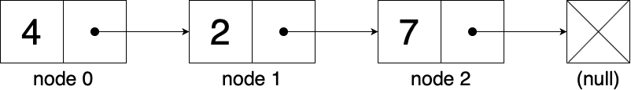

Is a linear **collection of data elements** (data usually referring to Objects) but also commonly used to store primitive values, whose order is not given by their physical placement in memory. Instead **each element points to the next**. This data structure allows for efficient insertion or removal of elements from any position of the sequence during iteration. The main drawback of linked lists is that **access time is linear**.
Linked Lists are among the simplest and most common data structures and can be used as a starting point to implement several other abstract data types, such as lists, stack, queues, though is not uncommon to implement those data structures directly without using a linked list as the basis.



## Example

This example demonstrates how to build a single-link linked list using **Python**.

### Node class

Our Node class is the foundation on which we will build our linked list, so it is very important to define all the necessary attributes that we will use later one, in this case as an example we will only work with a parameter **id**, to store some kind of id (school id for example), but more parameters can be easily added, it is also important to note that we will begin to work with **links** or **pointers** at this time, and in our constructor we will assign this pointer to None (null) because we are not building the list just yet.

``` python
class Node:
    #Remember that we do not need to declare our class attributes
    #in Python, only assign those attributes through our constructor
    def __init__(self, id): #constructor of class Node
        self.id = id  #assign the value sent as a parameter to our class atribute
        self.next = None #assign the pointer link to None (null)
```

### LinkedList class

Our linked list class is not more than a **collection of methods** utilized to alter in many different ways our linked list, here we can include methods such as: **add()**, **delete()**, **find()**, **traverse()**, **print_list()**, etc. in this example we will explore two methods: **add()** and **print_list()**, but more can be easily implemented, it is important to note that more often than note **recursion** is a good way of building this methods, although iteration tends to be faster, as this is a beginner example we will use iteration for the methods listed above.

``` python
class LinkedList:
    def __init__(self): #constructor of class LinkedList
        self.head = None #start our list empty, hence our head is None (null)

    #ADD method
    def add(self,node):
        if self.head is None: #verify if our LinkedList is empty
            self.head = node # if is empty assign the first node to our head
        else:
            temp = self.head
            while temp.next is not None: #iterate through our list until-
                temp = temp.next         #-we reach the end of it
            temp.next = node #assign the pointer link of the last -
                             #-element to our new element
    #PRINT method
    def print_list(self):
        if self.head is None: #verify if our LinkedList is empty
            print('The list is empty') #print a warning
        else:
            temp = self.head
            while temp.next is not None: #iterate our list printing each element-
                print(temp.id,end='')    #-as we go
                print('->',end='')
                temp = temp.next
            print(temp.id) #print the las element in order to avoid [1->2->3->]-
                           #-the last link pointing tu None (null)
```
### LinkedList instance

Finally we create a new instance of out LinkedList, add a couple of values and print our list to check if its working correctly.


``` python
list = LinkedList() #create a new LinkedList
list.add(Node(1)) #add element 1
list.add(Node(2)) #add element 2
list.add(Node(3)) #add element 3
list.print_list() #print the list
```

### Output

Our output should look something like this.

``` bash
1->2->3
```
